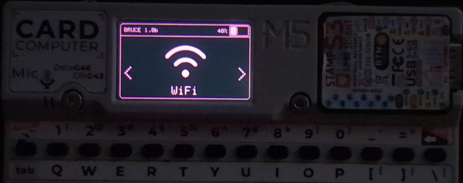
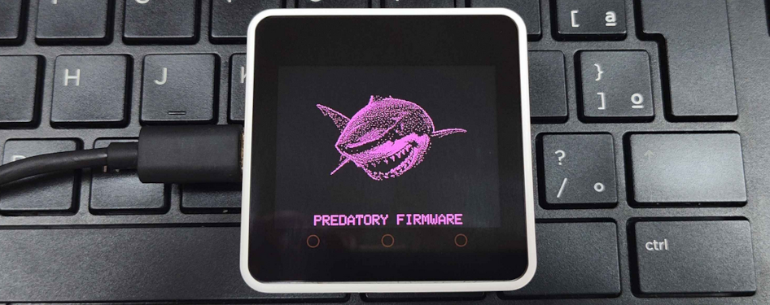
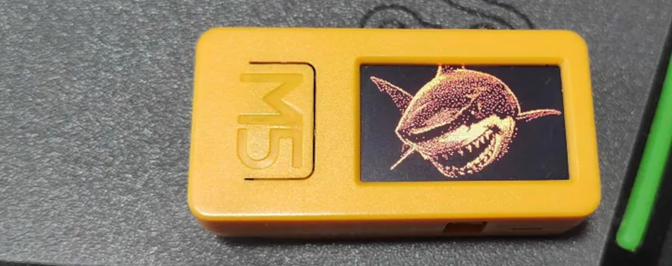
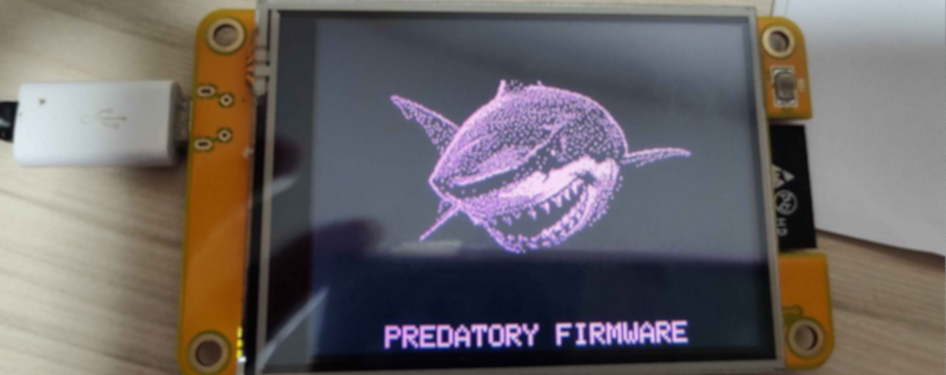

# :shark: Bruce

**Bruce** — это универсальная прошивка для ESP32, предназначенная для поддержки множества функций, ориентированных на проведение операций Red Team.  
Она также поддерживает устройства m5stack и отлично работает с Cardputer, Sticks и M5Cores.

## :building_construction: Как установить

### Самый простой способ установки Bruce — воспользоваться нашим официальным Web Flasher!  
### Подробнее на сайте: [https://bruce.computer/flasher](https://bruce.computer/flasher)

Или вы можете скачать последнюю версию бинарного файла из раздела релизов или actions и прошить его локально с помощью `esptool.py`:

```sh
esptool.py --port /dev/ttyACM0 write_flash 0x00000 Bruce-<устройство>.bin
```

**Для устройств m5stack**  

Если вы уже используете M5Launcher для управления устройством m5stack, вы можете установить Bruce через OTA.

Или прошить его напрямую с помощью [инструмента m5burner](https://docs.m5stack.com/en/download). Просто найдите "Bruce" (официальные сборки загружаются пользователем "owner" и содержат фотографии) в категории нужного устройства и нажмите "burn".

## :keyboard: Discord-сервер  

Свяжитесь с нами на нашем [Discord-сервере](https://discord.gg/WJ9XF9czVT)!

## :bookmark_tabs: Wiki

Для получения дополнительной информации о каждой функции, поддерживаемой Bruce, [ознакомьтесь с нашей вики здесь](https://github.com/pr3y/Bruce/wiki).  
Также советуем прочитать [раздел FAQ](https://github.com/pr3y/Bruce/wiki/FAQ).

## :computer: Список функций

<details>
  <summary><h2>WiFi</h2></summary>
  
- [x] Подключение к WiFi  
- [x] WiFi AP (Точка доступа)  
- [x] Отключение от WiFi  
- [x] [WiFi атаки](https://github.com/pr3y/Bruce/wiki/WiFi#wifi-atks)  
  - [x] [Beacon Spam](https://github.com/pr3y/Bruce/wiki/WiFi#beacon-spam)  
  - [x] [Целевая атака](https://github.com/pr3y/Bruce/wiki/WiFi#target-atk)  
    - [x] Сбор информации  
    - [x] Отключение целей (Deauth)  
    - [x] EvilPortal + Deauth  
  - [x] Массовый Deauth (несколько целей)  
- [x] [Wardriving](https://github.com/pr3y/Bruce/wiki/Wardriving)  
- [x] [TelNet](https://github.com/pr3y/Bruce/wiki/WiFi#telnet)  
- [x] [SSH](https://github.com/pr3y/Bruce/wiki/WiFi#ssh)  
- [x] [RAW Sniffer](https://github.com/pr3y/Bruce/wiki/WiFi#raw-sniffer)  
- [x] [DPWO-ESP32](https://github.com/pr3y/Bruce/wiki/WiFi#dpwo-esp32)  
- [x] [Evil Portal](https://github.com/pr3y/Bruce/wiki/WiFi#evil-portal)  
- [x] [Сканирование хостов](https://github.com/pr3y/Bruce/wiki/WiFi#scan-hosts)  
- [x] [Wireguard-туннелирование](https://github.com/pr3y/Bruce/wiki/WiFi#wireguard-tunneling)  
- [x] Brucegotchi  
  - [x] Поддержка Pwnagotchi  
  - [x] Спам лицами и именами в Pwngrid  
    - [x] [Опционально] Показать очень длинное имя и лицо на экране  
    - [x] [Опционально] Массовый спам уникальными идентификаторами пиров  

</details>

<details>
  <summary><h2>BLE</h2></summary>
    
- [X] [Сканирование BLE](https://github.com/pr3y/Bruce/wiki/BLE#ble-scan)  
- [X] Bad BLE — выполнение скриптов Ducky, аналогично [BadUsb](https://github.com/pr3y/Bruce/wiki/Others#badusb)  
- [X] BLE-клавиатура — только для Cardputer и T-Deck  
- [X] Спам iOS  
- [X] Спам Windows  
- [X] Спам Samsung  
- [X] Спам Android  
- [X] Спам для всех устройств  
</details>


<details>
  <summary><h2>RF</h2></summary>
    
- [X] Сканирование/копирование  
- [X] [Пользовательский SubGhz](https://github.com/pr3y/Bruce/wiki/RF#replay-payloads-like-flipper)  
- [X] Спектр  
- [X] Глушилка (Jammer) полная (отправляет квадратные волны на выход)  
- [X] Глушилка прерывистая (отправляет PWM-сигнал на выход)  
- [X] Конфигурация  
    - [X] RF TX Pin  
    - [X] RF RX Pin  
    - [X] RF-модуль  
        - [X] RF433 T/R M5Stack  
        - [X] [CC1101 (Sub-Ghz)](https://github.com/pr3y/Bruce/wiki/CC1101)  
    - [X] Частота RF  
- [X] Воспроизведение (Replay)  
</details>

<details>
  <summary><h2>RFID</h2></summary>
    
- [X] Чтение метки  
- [X] Чтение 125 кГц  
- [X] Клонирование метки  
- [X] Запись записей NDEF  
- [X] Amiibolink  
- [X] Chameleon  
- [X] Запись данных  
- [X] Удаление данных  
- [X] Сохранение файла  
- [X] Загрузка файла  
- [X] Конфигурация  
    - [X] [RFID-модуль](https://github.com/pr3y/Bruce/wiki/RFID#supported-modules)  
        - [X] PN532  
- [ ] Эмуляция метки  
</details>

<details>
  <summary><h2>IR</h2></summary>
    
- [X] TV-B-Gone  
- [X] Приемник ИК  
- [X] [Пользовательский ИК (NEC, NEC42, NECExt, SIRC, SIRC15, SIRC20, Samsung32, RC5, RC5X, RC6)](https://github.com/pr3y/Bruce/wiki/IR#replay-payloads-like-flipper)  
- [X] Конфигурация  
    - [X] Ir TX Pin  
    - [X] Ir RX Pin  
</details>

<details>
  <summary><h2>FM</h2></summary>
    
- [X] [Стандартная трансляция](https://github.com/pr3y/Bruce/wiki/FM#play_or_pause_button-broadcast-standard)  
- [X] [Резервная трансляция](https://github.com/pr3y/Bruce/wiki/FM#no_entry_sign-broadcast-rerserved)  
- [X] [Остановка трансляции](https://github.com/pr3y/Bruce/wiki/FM#stop_button-broadcast-stop)  
- [ ] [FM-спектр](https://github.com/pr3y/Bruce/wiki/FM#ocean-fm-spectrum)  
- [ ] [Перехват сообщений о дорожной обстановке](https://github.com/pr3y/Bruce/wiki/FM#car-hijack-ta)  
- [ ] [Конфигурация](https://github.com/pr3y/Bruce/wiki/FM#bookmark_tabs-config)  
</details>

<details>
  <summary><h2>NRF24</h2></summary>
    
- [X] [Глушилка NRF24](https://github.com/pr3y/Bruce/wiki/BLE#nrf24-jammer)  
- [X] 2.4G спектр  
- [ ] Mousejack  
</details>

<details>
  <summary><h2>Скрипты</h2></summary>
    
- [X] [Интерпретатор JavaScript](https://github.com/pr3y/Bruce/wiki/Interpreter) [Благодарность justinknight93](https://github.com/justinknight93/Doolittle)  
</details>

<details>
  <summary><h2>Прочее</h2></summary>
    
- [X] Спектр микрофона  
- [X] QR-коды  
    - [X] Пользовательский  
    - [X] PIX (система банковских переводов Бразилии)  
- [X] [Менеджер SD-карт](https://github.com/pr3y/Bruce/wiki/Others#sd-card-mngr)  
    - [X] Просмотр изображений (jpg)  
    - [X] Информация о файле  
    - [X] [Загрузка Wigle](https://github.com/pr3y/Bruce/wiki/Wardriving#how-to-upload)  
    - [X] Воспроизведение аудио  
    - [X] Просмотр файлов  
- [X] [Менеджер LittleFS](https://github.com/pr3y/Bruce/wiki/Others#littlefs-mngr)  
- [X] [Веб-интерфейс (WebUI)](https://github.com/pr3y/Bruce/wiki/Others#webui)  
    - [X] Структура сервера  
    - [X] Html  
    - [X] Менеджер SD-карт  
    - [X] Менеджер Spiffs  
- [X] Megalodon  
- [X] [BADUsb (новые функции: LittleFS и SDCard)](https://github.com/pr3y/Bruce/wiki/Others#badusb)  
- [X] USB-клавиатура — только для Cardputer и T-Deck  
- [X] [Openhaystack](https://github.com/pr3y/Bruce/wiki/Others#openhaystack)  
- [X] [Управление светодиодами (LED Control)](https://github.com/pr3y/Bruce/wiki/Others#led-control)  
</details>

<details>
  <summary><h2>Часы</h2></summary>
    
- [X] Поддержка RTC  
- [X] Синхронизация времени через NTP  
- [X] Ручная настройка  
</details>

<details>
  <summary><h2>Подключение (ESPNOW)</h2></summary>
    
- [X] Отправка файла  
- [X] Приём файла  
</details>

<details>
  <summary><h2>Настройки</h2></summary>
    
- [X] Яркость  
- [X] Таймер затемнения  
- [X] Ориентация  
- [X] Цвет интерфейса  
- [X] Звук загрузки (вкл./выкл.)  
- [X] Часы  
- [X] Режим сна  
- [X] Перезагрузка  
</details>

## Специфические функции для устройств, не упомянутые здесь, доступны для всех.
| Устройство               | CC1101    | NRF24     | Интерпретатор | FMRadio   | PN532     | Mic_SPM1423     | BadUSB    | RGB Led | Динамик | LITE_MODE |
| ------------------------ | --------- | --------- | ------------- | --------- | --------- | --------------- | --------- | ------- | ------- | --------- |
| Cardputer                | :ok:      | :ok:      | :ok:          | :ok:      | :ok:      | :ok:            | :ok:      | :ok:    | NS4168  | :x:       |
| StickCPlus2              | :ok:      | :ok:      | :ok:          | :ok:      | :ok:      | :ok:            | :ok:¹     | :x:     | Tone    | :x:       |
| StickCPlus 1.1           | :ok:      | :ok:      | :x:           | :ok:      | :ok:      | :ok:            | :ok:¹     | :x:     | Tone    | :x:²      |
| Core                     | :x:       | :x:       | :x:           | :x:       | :x:       | :ok:            | :ok:¹     | :x:     | Tone    | :x:       |
| Core2                    | :x:       | :x:       | :x:           | :x:       | :x:       | :ok:            | :ok:¹     | :x:     | :x:     | :x:       |
| CoreSe/SE                | :x:       | :x:       | :ok:          | :x:       | :x:       | :x:             | :ok:      | :x:     | :x:     | :x:       |
| CYD-2432S028             | :ok:      | :ok:      | :ok:          | :x:       | :ok:      | :x:             | :ok:¹     | :x:     | :x:     | :x:²      |
| Lilygo T-Embed CC1101    | :ok:      | :x:       | :ok:          | :x:       | :ok:      | :ok:            | :ok:      | :x:     | :x:     | :x:       |
| Lilygo T-Embed           | :x:       | :x:       | :ok:          | :x:       | :ok:      | :ok:            | :ok:      | :x:     | :x:     | :x:       |
| Lilygo T-Deck (и pro)    | :x:       | :x:       | :ok:          | :x:       | :x:       | :x:             | :ok:      | :x:     | :x:     | :x:       |

² CYD и StickCPlus 1.1 имеют версию LITE_VERSION для совместимости с Launcher
¹ Core, CYD и StickCs Bad-USB: [здесь](https://github.com/pr3y/Bruce/wiki/Others#badusb)

*LITE_MODE*: TelNet, SSH, DPWO, WireGuard, ScanHosts, RawSniffer, Brucegotchi, BLEBacon, BLEScan, Интерпретатор и OpenHaystack недоступны для совместимости с M5Launcher.


## :sparkles: Почему и как это выглядит?

Bruce возник в результате внимательного наблюдения за сообществом, которое занимается устройствами, такими как Flipper Zero. Хотя эти устройства предлагали взглянуть в мир наступательной безопасности, было очевидно, что можно добиться большего, не переплачивая, особенно с учетом мощной и модульной аппаратной экосистемы, предоставляемой устройствами ESP32, а также продуктами Lilygo и M5Stack.






Другие медиа можно [найти здесь](./media/).

## :clap: Благодарности

+ [@bmorcelli](https://github.com/bmorcelli) за новый ядро и множество новых функций, а также портирование на множество устройств!
+ [@IncursioHack](https://github.com/IncursioHack) за добавление функций RF и RFID модулей.
+ [@Luidiblu](https://github.com/Luidiblu) за помощь в разработке логотипа и UI.
+ [@eadmaster](https://github.com/eadmaster) за добавление множества функций.
+ [@rennancockles](https://github.com/rennancockles) за большой объем кода RFID, рефакторинг и другие функции.
+ Всем, кто так или иначе способствовал проекту, спасибо :heart:

## :construction: Отказ от ответственности

Bruce — это инструмент для кибер-нападений и операций Red Team, распространяемый на условиях Affero General Public License (AGPL). Он предназначен исключительно для легитимных и авторизованных целей безопасности. Использование этого программного обеспечения для любых вредоносных или несанкционированных действий строго запрещено. Загрузив, установив или используя Bruce, вы соглашаетесь соблюдать все применимые законы и регламенты. Это программное обеспечение предоставляется бесплатно, и мы не принимаем оплату за копии или модификации. Разработчики Bruce не несут ответственности за любое злоупотребление программным обеспечением. Используйте на свой страх и риск.

